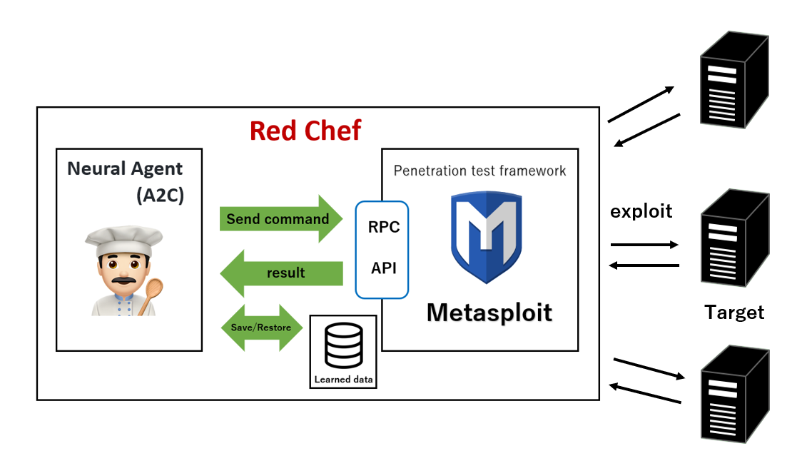
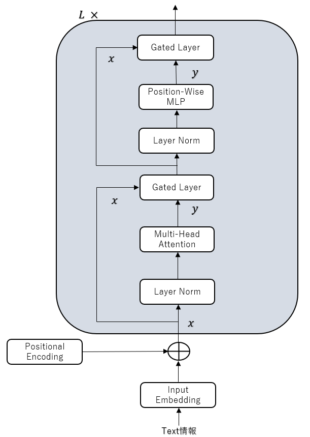
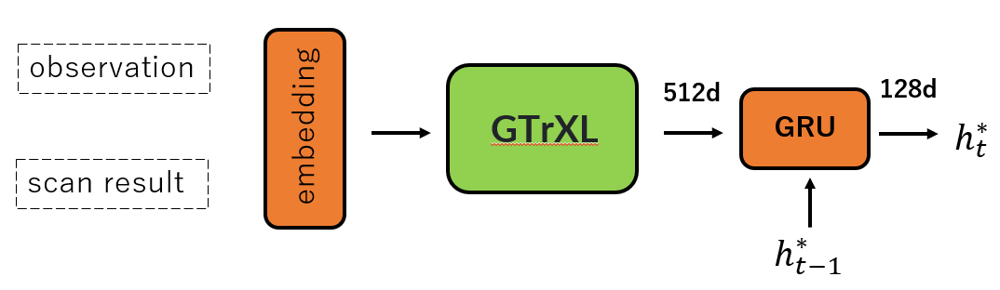

# RedChef
**Fully automatic penetration test tool using Deep Reinforcement Learning.**  

---

DeepExploit identifies the status of all opened ports on the target server and **executes the exploit at pinpoint using Machine Learning**. It's key features are following.  

 * **Efficiently execute exploit**.  
 DeepExploit can **execute exploits at pinpoint** (minimum 1 attempt) using Machine Learning.  

 * **Deep penetration**.  
 If DeepExploit succeeds the exploit to the target server, it further executes the exploit to other internal servers.  
 
 * **Self-learning**.  
 DeepExploit can learn how to exploitation by itself (uses **Reinforcement Learning**).  
 It is not necessary for humans to prepare learning data.  
 
 * **Learning time is very fast**.  
 Generally, reinforcement learning takes a lot of time.  
 So, DeepExploit uses **distributed learning by multi agents**.  
 We adopted an advanced machine learning model called **[A3C](https://arxiv.org/pdf/1602.01783.pdf)**.  

 * **Powerful intelligence gathering**  
 To gather the information of software operated on the target server is very important for successful the exploitation. DeepExploit can identify product name and version using following methods.  
   * Port scanning  
   * Machine Learning (Analyze HTTP responses gathered by Web crawling)  
   * Contents exploration  

### Abilities of "Deep Exploit".  
 Current DeepExploit's version is a **beta**.  
 But, it can fully automatically execute following actions:  

 * Intelligence gathering.  
 * Threat modeling.  
 * Vulnerability analysis.  
 * Exploitation.  
 * Post-Exploitation.  
 * Reporting.  

### DeepExploit System component.  
  

DeepExploit consists of the **machine learning model (A3C)** and **Metasploit**.  
The A3C executes exploit to the target servers via **RPC API**.  

The A3C is developped by Keras and Tensorflow that famous ML framework based on Python. It is used to **self-learn exploit's way** using deep reinforcement learning. The self-learned's result is stored to **learned data that reusable**.  

Metasploit is most famous penetration test tool in the world. It is used to **execute an exploit to the target servers** based on instructions from the A3C.  

#### How to Train?  
  

RedChefの概要図である。DeepExploitで使用されていたA3Cの部分をLedeepChefで用いられていたニューラルエージェントに変更している。
ニューラルエージェントはPOMDPベースのエージェントであり、GRUを基に部分観測情報をエンコードし、アクションの確率を出力する。

GTrXLの概要図である。こちらはTransformer-xlにGRUの要素入れて過学習を抑え、Transformerを強化学習に適用できるようにした手法である。

RedChef＋GtrXLの手法のエンコーダ部分の図である。 

